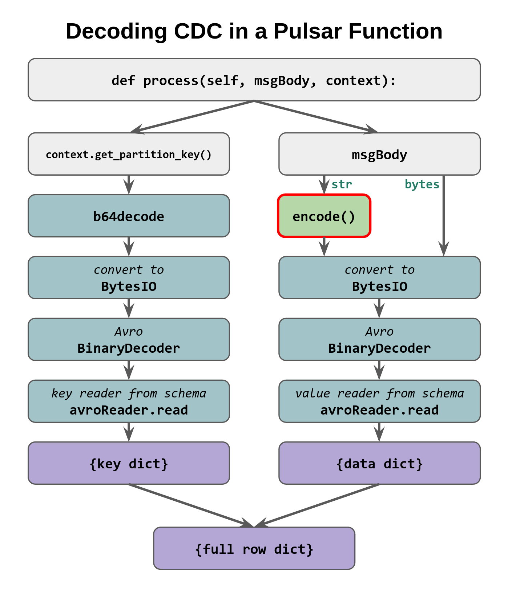

# Astra Streaming, CDC and decoding

### Problem statement

> We have CDC enabled from an Astra DB table
> to an Astra Streaming topic and we want to decode the content
> of each event to have it e.g. as a plain JSON.

We want to do it **in Python**.

We want to be able to do it both in a standalone consumer Python script
and **within a Streaming Function**.

### Breakdown

First do it with a standard Python script, then do it
within a Streaming Function.

_(In particular, the latter will be used to "de-schemaify" the CDC topic,
i.e. for each incoming Avro-schemaful CDC event we want to publish a
plain-JSON counterpart to another, schemaless topic. This is but one of
the many possible applications of the findings presented here.)_

Prepare for a small **surprise** that arose while completing this exercise,
a small difference between the standalone-script
and the pulsar-function encoding schemes that, as always with Pulsar functions,
was somewhat cumbersome to track and debug.

#### Schema for Avro

Note that a fixed starting point is the schema structure for creating the
Avro decoders. Two such structures exist, one for the "data columns" and one
for the primary key stuff, and they can be read off the Astra Streaming UI
(auto-populated once at least one CDC event goes through).

The example CDC consumer code on the Streaming site does query dynamically
and endpoint that gives the schema for the table, but then does some cleanup
of it, etc. Or at least it appears to work like that: I never got the example
to work as is and had to fiddle quite a bit, ending up copypasting the schema
JSON manually into my project.

Alternatively, you can manually build the schema descriptor structure,
if you dare (keeping unions with `None`s into accunt and the like.
Good luck).

## Setup I (table and CDC)

We need a table in a keyspace and a Streaming tenant in the same cloud
provider and region. Here:

```
keyspace = track3demo
tenant = track3demo
Provider/region = GCP / useast1
```

Table:

```
CREATE TABLE track3demo.reviews (
    hotel TEXT,
    id TIMEUUID,
    reviewer TEXT,
    body TEXT,
    is_valid BOOLEAN,
    score INT,
    PRIMARY KEY ( (hotel), id )
  ) WITH CLUSTERING ORDER BY ( id DESC );
```

Typical insert (to test it all later):

```
INSERT INTO track3demo.reviews
  (hotel, id, reviewer, body, is_valid, score)
VALUES
  ('Fungal Resort', now(), 'Geppo', 'The cockroaches are kind and helpful', true, 6);
```

Enable CDC: you do it on the database, picking the target tenant and the source keyspace/table.
Refresh the page, CDC should become "Running" immediately.

Now _write a row to DB for the schema to be auto-detected in the topic_ (very useful later).

## Standalone script

### Schema

Either by inspecting the autogenerated `track3demo/astracdc/data-BLABLABLA-track3demo.reviews`
CDC topic, or magically because you are an Avro level-12 sorcerer, retrieve two JSON
descriptions for the partition-key columns and the data-columns of
the table.
(Incidentally, if you go to the "Try me" feature it 403s.)

> Key and values schemas are separate, corresponding to how the CDC messages keep
> the former in the "(streaming) partition key" and the latter in the "data" of the CDC events it produces.

You can strip the `namespace` and `doc` fields away to make the schemas slimmer,
they don't actually do anything for us. The final schema docs, recast as Python dictionaries,
look like this (note there are several Python `None` values but also `"null"` _string_ literals around):

```python
keySchemaDict = {
    "type": "record",
    "name": "reviews",
    "fields": [
        {
            "name": "hotel",
            "type": "string"
        },
        {
            "name": "id",
            "type": [
                "null",
                {
                    "type": "string",
                    "logicalType": "uuid"
                }
            ],
            "default": None
        }
    ]
}

valueSchemaDict = {
    "type": "record",
    "name": "reviews",
    "fields": [
        {
            "name": "body",
            "type": [
                "null",
                "string"
            ],
            "default": None
        },
        {
            "name": "reviewer",
            "type": [
                "null",
                "string"
            ],
            "default": None
        },
        {
            "name": "is_valid",
            "type": [
                "null",
                "boolean"
            ],
            "default": None
        },
        {
            "name": "score",
            "type": [
                "null",
                "int"
            ],
            "default": None
        }
    ]
}
```

### Python dependencies

You need these (preferrably in a Python virtual environment).

    avro==1.11.1
    pulsar-client==2.10.2

At the time of writing, these are the correct versions to use.

### Secrets/parameters required

Grab the following on Astra Streaming UI:

- `service_url`, something like `"pulsar+ssl://pulsar-gcp-useast1.streaming.datastax.com:6651"`;
- `topic_name`, looking like `"track3demo/astracdc/data-0114844e-720a-4487-92d4-4c07ada112e3-track3demo.reviews"` (use the fully-qualified name here);
- `token` (this is **secret**), a long long string of characters.

Put these in your copy of `standalone/cdc-reader.py`.

### Layers of encoding

The program is now good to run. After launching
`python standalone/cdc-reader.py`,
try to insert a row in the table and watch.

Notice that as said earlier the script collates the columns found in the
message partition key and in the "data" (i.e. the body),
to reconstruct the whole written row.

The way these two parts are encoded is not entirely trivial: namely,

```
    msg.partition_key()   is a 'string' (a b64-encoded string)
    msg.data()            is 'bytes'
```

So the (rather layered!) chain of decodings look like:


Also note that many CQL data types get "trivialized" to simpler types: for
instance, `uuid`s become simple strings. This comes handy since we aim at
producing a JSON, but still is worth noting. No tests have been done on date/time types
or other stuff (yet).

## Setup II (schemaless topic)

Just create a topic in the same tenant, any namespace is fine.
Here it will be the `default/dummy` topic.

## Deschemaifying Streaming Function

We now want the same logic to work in a Pulsar function, with the goal of
seeing the row JSON documents being published to the "schemaless topic"
just created, for any downstream consumption.

Besides the task of correctly packaging the required dependency (`avro`)
for use within the function, as we'll see, unexpected differences arise in how
the parts of the row are (accessed, and) encoded.

### Dependencies and packaging

We will upload a [zip-file](https://pulsar.apache.org/docs/2.11.x/functions-package-python/#zip-file)
containing the function definition (as a class)
and any required dependency in the form of a Python wheel (`*.whl` file).
The Astra Streaming
[docs page](https://docs.datastax.com/en/streaming/astra-streaming/developing/astream-functions.html)
seem to reassure that this is the way.

There are no ready-made wheels for Avro, so as instructed
[here](https://pip.pypa.io/en/stable/cli/pip_wheel/) we simply run

```
pip wheel avro==1.11.1
```

which indeed creates the wheel for Avro.

The structure of the zip file is seen in the
[reference example on the Pulsar docs](https://github.com/apache/pulsar/blob/master/tests/docker-images/latest-version-image/python-examples/exclamation.zip) and will be as follows:

```
deschemaer.zip <====> .
                      └── deschemaer
                          ├── deps
                          │   └── avro-1.11.1-py2.py3-none-any.whl
                          └── src
                              └── deschemaer.py
```

> _Note:_ such a zip file, with `deschemaer` in it,
> can be created in the `function` directory
> with the command `zip -r deschemaer.zip deschemaer`.

In the function code, we can now happily use statements such as `import avro.schema` and the like.

### The function

We have to package the message processing as the `process()` method of a
class extending `pulsar.Function` in order to be able to access the
[context](https://pulsar.apache.org/docs/2.10.x/functions-develop/#context),
which is how you read the partition key for the incoming message.

So the class will begin like this:

```python
class Deschemaer(Function):
    def process(self, msgBody, context):
        msgPK = context.get_partition_key()
        ...
        ...
        ...
```

**TODO:** move the `createAvroReader` calls in the class constructor to avoid
the ugly global variable trick. No problems expected with that.

For the whole code and the ready-made zipfile, look into the `function` directory.

To set up the function one needs to specify the source and destination topics
when uploading the zip file and that's it.

### Layers of encoding

There's a subtle difference with the stand-alone script:
the message body is _not_ `bytes` this time, rather it is a string
and as such it must be additionally `.encode()`d before the
rest of the transformations.

In short:


